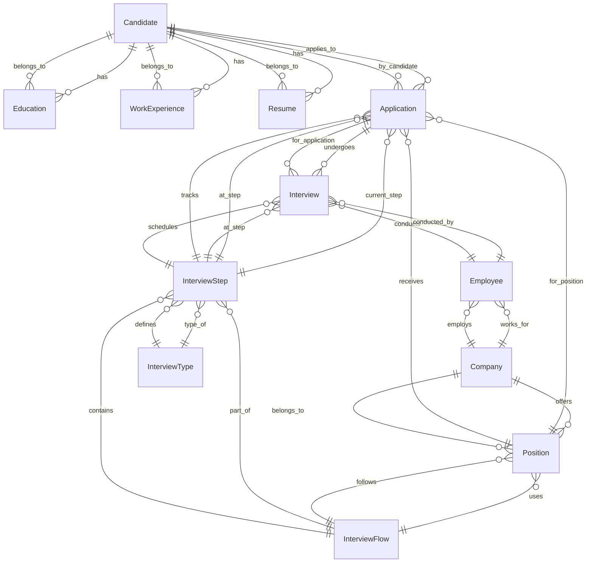

# Modelo de Datos - LTI Talent Tracking System

## Descripción General

Este documento describe el modelo de datos del sistema LTI (Learning Technologies International), un sistema integral de gestión de talento y reclutamiento (ATS). El modelo está diseñado para manejar el ciclo completo de selección de personal, desde la gestión de candidatos hasta el seguimiento de entrevistas y contrataciones.

## Base de Datos

- **Sistema**: PostgreSQL
- **ORM**: Prisma
- **Características**: Base de datos relacional con integridad referencial

---

## Entidades del Sistema

### 1. Candidate (Candidato)

**Descripción**: Entidad central que representa a los candidatos que aplican a posiciones en la empresa.

**Campos**:
- `id` (Int, PK): Identificador único del candidato
- `firstName` (String[100]): Nombre del candidato
- `lastName` (String[100]): Apellido del candidato
- `email` (String[255], Unique): Correo electrónico único
- `phone` (String[15], Optional): Número de teléfono
- `address` (String[100], Optional): Dirección del candidato

**Relaciones**:
- **One-to-Many** con `Education`: Un candidato puede tener múltiples formaciones académicas
- **One-to-Many** con `WorkExperience`: Un candidato puede tener múltiples experiencias laborales
- **One-to-Many** con `Resume`: Un candidato puede tener múltiples CVs
- **One-to-Many** con `Application`: Un candidato puede aplicar a múltiples posiciones

### 2. Education (Educación)

**Descripción**: Registra la formación académica de los candidatos.

**Campos**:
- `id` (Int, PK): Identificador único de la formación
- `institution` (String[100]): Nombre de la institución educativa
- `title` (String[250]): Título o grado obtenido
- `startDate` (DateTime): Fecha de inicio de los estudios
- `endDate` (DateTime, Optional): Fecha de finalización de los estudios
- `candidateId` (Int, FK): Referencia al candidato

**Relaciones**:
- **Many-to-One** con `Candidate`: Múltiples formaciones pertenecen a un candidato

### 3. WorkExperience (Experiencia Laboral)

**Descripción**: Almacena la experiencia profesional previa de los candidatos.

**Campos**:
- `id` (Int, PK): Identificador único de la experiencia
- `company` (String[100]): Nombre de la empresa
- `position` (String[100]): Cargo ocupado
- `description` (String[200], Optional): Descripción de las responsabilidades
- `startDate` (DateTime): Fecha de inicio del trabajo
- `endDate` (DateTime, Optional): Fecha de finalización del trabajo
- `candidateId` (Int, FK): Referencia al candidato

**Relaciones**:
- **Many-to-One** con `Candidate`: Múltiples experiencias pertenecen a un candidato

### 4. Resume (Currículum)

**Descripción**: Gestiona los archivos de CV subidos por los candidatos.

**Campos**:
- `id` (Int, PK): Identificador único del CV
- `filePath` (String[500]): Ruta del archivo en el sistema
- `fileType` (String[50]): Tipo de archivo (PDF, DOC, etc.)
- `uploadDate` (DateTime): Fecha de subida del archivo
- `candidateId` (Int, FK): Referencia al candidato

**Relaciones**:
- **Many-to-One** con `Candidate`: Múltiples CVs pertenecen a un candidato

### 5. Company (Empresa)

**Descripción**: Representa a las empresas cliente que contratan personal.

**Campos**:
- `id` (Int, PK): Identificador único de la empresa
- `name` (String, Unique): Nombre de la empresa

**Relaciones**:
- **One-to-Many** con `Employee`: Una empresa puede tener múltiples empleados
- **One-to-Many** con `Position`: Una empresa puede publicar múltiples posiciones

### 6. Employee (Empleado)

**Descripción**: Representa a los empleados de las empresas que participan en entrevistas.

**Campos**:
- `id` (Int, PK): Identificador único del empleado
- `companyId` (Int, FK): Referencia a la empresa
- `name` (String): Nombre del empleado
- `email` (String, Unique): Correo electrónico único
- `role` (String): Cargo o rol del empleado
- `isActive` (Boolean, Default: true): Estado activo del empleado

**Relaciones**:
- **Many-to-One** con `Company`: Múltiples empleados pertenecen a una empresa
- **One-to-Many** con `Interview`: Un empleado puede realizar múltiples entrevistas

### 7. Position (Posición)

**Descripción**: Representa las vacantes o posiciones disponibles en las empresas.

**Campos**:
- `id` (Int, PK): Identificador único de la posición
- `companyId` (Int, FK): Referencia a la empresa
- `interviewFlowId` (Int, FK): Referencia al flujo de entrevista
- `title` (String): Título del puesto
- `description` (String): Descripción general del puesto
- `status` (String, Default: "Draft"): Estado de la posición
- `isVisible` (Boolean, Default: false): Visibilidad pública de la posición
- `location` (String): Ubicación del puesto
- `jobDescription` (String): Descripción detallada del trabajo
- `requirements` (String, Optional): Requisitos del puesto
- `responsibilities` (String, Optional): Responsabilidades del puesto
- `salaryMin` (Float, Optional): Salario mínimo
- `salaryMax` (Float, Optional): Salario máximo
- `employmentType` (String, Optional): Tipo de empleo
- `benefits` (String, Optional): Beneficios ofrecidos
- `companyDescription` (String, Optional): Descripción de la empresa
- `applicationDeadline` (DateTime, Optional): Fecha límite de aplicación
- `contactInfo` (String, Optional): Información de contacto

**Relaciones**:
- **Many-to-One** con `Company`: Múltiples posiciones pertenecen a una empresa
- **Many-to-One** con `InterviewFlow`: Múltiples posiciones pueden usar el mismo flujo de entrevista
- **One-to-Many** con `Application`: Una posición puede recibir múltiples candidaturas

### 8. InterviewType (Tipo de Entrevista)

**Descripción**: Define los diferentes tipos de entrevistas disponibles.

**Campos**:
- `id` (Int, PK): Identificador único del tipo de entrevista
- `name` (String): Nombre del tipo de entrevista
- `description` (String, Optional): Descripción del tipo de entrevista

**Relaciones**:
- **One-to-Many** con `InterviewStep`: Un tipo de entrevista puede tener múltiples pasos

### 9. InterviewFlow (Flujo de Entrevista)

**Descripción**: Define el proceso completo de entrevistas para una posición.

**Campos**:
- `id` (Int, PK): Identificador único del flujo
- `description` (String, Optional): Descripción del flujo de entrevista

**Relaciones**:
- **One-to-Many** with `InterviewStep`: Un flujo puede tener múltiples pasos
- **One-to-Many** with `Position`: Múltiples posiciones pueden usar el mismo flujo

### 10. InterviewStep (Paso de Entrevista)

**Descripción**: Representa cada paso individual dentro de un flujo de entrevista.

**Campos**:
- `id` (Int, PK): Identificador único del paso
- `interviewFlowId` (Int, FK): Referencia al flujo de entrevista
- `interviewTypeId` (Int, FK): Referencia al tipo de entrevista
- `name` (String): Nombre del paso
- `orderIndex` (Int): Orden del paso en el flujo

**Relaciones**:
- **Many-to-One** with `InterviewFlow`: Múltiples pasos pertenecen a un flujo
- **Many-to-One** with `InterviewType`: Múltiples pasos pueden ser del mismo tipo
- **One-to-Many** with `Application`: Un paso puede tener múltiples aplicaciones
- **One-to-Many** with `Interview`: Un paso puede tener múltiples entrevistas

### 11. Application (Aplicación)

**Descripción**: Representa la candidatura de un candidato a una posición específica.

**Campos**:
- `id` (Int, PK): Identificador único de la aplicación
- `positionId` (Int, FK): Referencia a la posición
- `candidateId` (Int, FK): Referencia al candidato
- `applicationDate` (DateTime): Fecha de la aplicación
- `currentInterviewStep` (Int, FK): Referencia al paso actual en el flujo
- `notes` (String, Optional): Notas sobre la aplicación

**Relaciones**:
- **Many-to-One** with `Position`: Múltiples aplicaciones pertenecen a una posición
- **Many-to-One** with `Candidate`: Múltiples aplicaciones pertenecen a un candidato
- **Many-to-One** with `InterviewStep`: Una aplicación está en un paso específico del flujo
- **One-to-Many** with `Interview`: Una aplicación puede tener múltiples entrevistas

### 12. Interview (Entrevista)

**Descripción**: Registra las entrevistas realizadas durante el proceso de selección.

**Campos**:
- `id` (Int, PK): Identificador único de la entrevista
- `applicationId` (Int, FK): Referencia a la aplicación
- `interviewStepId` (Int, FK): Referencia al paso de entrevista
- `employeeId` (Int, FK): Referencia al empleado que realiza la entrevista
- `interviewDate` (DateTime): Fecha y hora de la entrevista
- `result` (String, Optional): Resultado de la entrevista
- `score` (Int, Optional): Puntuación obtenida
- `notes` (String, Optional): Notas de la entrevista

**Relaciones**:
- **Many-to-One** with `Application`: Múltiples entrevistas pertenecen a una aplicación
- **Many-to-One** with `InterviewStep`: Múltiples entrevistas pertenecen a un paso
- **Many-to-One** with `Employee`: Múltiples entrevistas pueden ser realizadas por un empleado

---

## Diagrama del Modelo de Datos

---

## Relaciones Clave del Sistema

### 1. **Gestión de Candidatos**
- Un candidato puede tener múltiples formaciones académicas, experiencias laborales y CVs
- Cada candidato puede aplicar a múltiples posiciones simultáneamente

### 2. **Flujo de Entrevistas**
- Cada posición tiene un flujo de entrevista predefinido
- Los flujos se componen de pasos secuenciales
- Cada paso tiene un tipo específico de entrevista

### 3. **Seguimiento de Aplicaciones**
- Cada aplicación sigue un flujo de entrevista específico
- Las aplicaciones avanzan paso a paso a través del flujo
- Se registran todas las entrevistas realizadas en cada paso

### 4. **Gestión de Empresas**
- Las empresas pueden tener múltiples empleados y posiciones
- Los empleados participan en entrevistas como evaluadores

---

## Consideraciones de Diseño

### **Integridad Referencial**
- Todas las relaciones están protegidas con claves foráneas
- Las eliminaciones en cascada están configuradas apropiadamente
- Los campos obligatorios están marcados como NOT NULL

### **Normalización**
- El modelo está normalizado para evitar redundancia de datos
- Las entidades están separadas lógicamente por responsabilidad
- Se mantiene la integridad de los datos a través de relaciones bien definidas

### **Escalabilidad**
- El diseño permite agregar nuevos tipos de entrevistas y flujos
- Se pueden manejar múltiples empresas y posiciones simultáneamente
- El sistema soporta un alto volumen de candidatos y aplicaciones

---

## Campos de Auditoría y Metadatos

### **Timestamps Automáticos**
- `applicationDate`: Fecha de aplicación del candidato
- `uploadDate`: Fecha de subida de CVs
- `interviewDate`: Fecha y hora de las entrevistas

### **Estados y Seguimiento**
- `status`: Estado de las posiciones (Draft, Active, Closed)
- `isVisible`: Control de visibilidad pública de posiciones
- `isActive`: Estado activo de los empleados
- `currentInterviewStep`: Seguimiento del progreso en el flujo

---

*Documento generado para el proyecto LTI - Talent Tracking System*
*Versión: 1.0*
*Fecha: 2025*
*Base de Datos: PostgreSQL con Prisma ORM*
