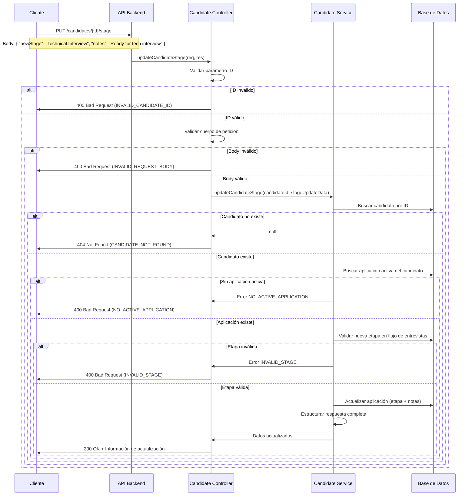

# Historia de Usuario #2: PUT /candidates/:id/stage

## 📝 **Descripción Funcional Completa**

### **Historia de Usuario Original**
Como reclutador del sistema LTI, quiero poder actualizar la etapa del proceso de entrevista en la que se encuentra un candidato específico, para mantener un seguimiento preciso del progreso de cada candidato en el proceso de selección.

### **Diagrama de Secuencia**



### **Funcionalidad Detallada**

1. **Recepción de la petición**: El endpoint recibe una petición PUT con el ID del candidato y los datos de actualización
2. **Validación de parámetros**: Se valida que el ID sea un número entero válido y positivo
3. **Validación del cuerpo**: Se verifica que el campo `newStage` esté presente y las `notes` no excedan 500 caracteres
4. **Verificación del candidato**: Se confirma que el candidato existe en la base de datos
5. **Búsqueda de aplicación activa**: Se obtiene la aplicación más reciente del candidato
6. **Validación de la nueva etapa**: Se verifica que la nueva etapa existe en el flujo de entrevistas de la posición
7. **Actualización atómica**: Se actualiza la etapa actual y las notas en una sola transacción
8. **Estructuración de respuesta**: Se devuelve información completa sobre el cambio realizado

### **Criterios de Aceptación Funcionales**

- ✅ El sistema debe permitir actualizar la etapa de cualquier candidato válido
- ✅ La nueva etapa debe existir en el flujo de entrevistas de la posición aplicada
- ✅ Se debe actualizar tanto la etapa como las notas opcionales
- ✅ La respuesta debe incluir información de la etapa anterior y la nueva
- ✅ Si el candidato no existe, debe retornar error 404
- ✅ Si la etapa es inválida, debe retornar error 400
- ✅ La actualización debe ser atómica (todo o nada)

## 🔧 **Especificaciones Técnicas**

### **Endpoint**
- **Método**: `PUT`
- **URL**: `/candidates/:id/stage`

### **Parámetros de Entrada**
- **Parámetro de ruta**: `id` (número entero, ID del candidato)
- **Cuerpo de la petición**:
```json
{
  "newStage": "Technical Interview",
  "notes": "Candidato aprobó screening inicial. Listo para entrevista técnica."
}
```

#### **Campos del Body**
- `newStage` (string, requerido): Nombre de la nueva etapa
- `notes` (string, opcional): Notas adicionales (máximo 500 caracteres)

### **Respuesta Exitosa (200 OK)**
```json
{
  "success": true,
  "data": {
    "candidateId": 2,
    "applicationId": 2,
    "candidateName": "María García",
    "positionTitle": "Software Engineer",
    "previousStage": {
      "id": 1,
      "name": "Initial Screening",
      "orderIndex": 1
    },
    "currentStage": {
      "id": 2,
      "name": "Technical Interview",
      "orderIndex": 2
    },
    "updatedAt": "2024-08-18T10:30:00.000Z",
    "notes": "Candidato aprobó screening inicial. Listo para entrevista técnica."
  }
}
```

### **Respuestas de Error**

#### **400 Bad Request - ID Inválido**
```json
{
  "success": false,
  "error": {
    "code": "INVALID_CANDIDATE_ID",
    "message": "El ID del candidato debe ser un número entero válido",
    "details": "El parámetro 'id' recibido no es un número entero válido"
  }
}
```

#### **400 Bad Request - Body Inválido**
```json
{
  "success": false,
  "error": {
    "code": "INVALID_REQUEST_BODY",
    "message": "El campo 'newStage' es requerido",
    "details": "El cuerpo de la petición debe contener un campo 'newStage' válido"
  }
}
```

#### **400 Bad Request - Notas Muy Largas**
```json
{
  "success": false,
  "error": {
    "code": "INVALID_NOTES_LENGTH",
    "message": "Las notas no pueden exceder 500 caracteres",
    "details": "El campo 'notes' debe tener máximo 500 caracteres"
  }
}
```

#### **400 Bad Request - Sin Aplicación Activa**
```json
{
  "success": false,
  "error": {
    "code": "NO_ACTIVE_APPLICATION",
    "message": "El candidato no tiene aplicaciones activas",
    "details": "No se encontró ninguna aplicación para actualizar la etapa"
  }
}
```

#### **400 Bad Request - Etapa Inválida**
```json
{
  "success": false,
  "error": {
    "code": "INVALID_STAGE",
    "message": "La etapa especificada no es válida para este candidato",
    "details": "La etapa no existe en el flujo de entrevistas de la posición aplicada"
  }
}
```

#### **404 Not Found**
```json
{
  "success": false,
  "error": {
    "code": "CANDIDATE_NOT_FOUND",
    "message": "El candidato especificado no existe",
    "details": "No se encontró ningún candidato con el ID proporcionado"
  }
}
```

#### **500 Internal Server Error**
```json
{
  "success": false,
  "error": {
    "code": "INTERNAL_SERVER_ERROR",
    "message": "Error interno del servidor",
    "details": "Ha ocurrido un error inesperado en el servidor"
  }
}
```

### **Modelos de Datos Afectados**
- `Candidate` - Para verificar existencia del candidato
- `Application` - Para actualizar `current_interview_step` y `notes`
- `Position` - Para obtener el flujo de entrevistas
- `InterviewStep` - Para validar la nueva etapa
- `InterviewFlow` - Para el contexto del flujo de entrevistas

### **Archivos a Modificar**
- `src/routes/candidateRoutes.ts` - Agregar ruta PUT /:id/stage
- `src/presentation/controllers/candidateController.ts` - Función updateCandidateStage
- `src/application/services/candidateService.ts` - Lógica de actualización
- `src/domain/models/ApplicationStage.ts` - Interfaces TypeScript

## ✅ **Criterios de Aceptación Técnicos**

- ✅ El endpoint debe validar que el `id` del candidato exista en la tabla `candidates`
- ✅ Se debe validar que el valor de `newStage` enviado corresponda a una etapa válida dentro del flujo de entrevistas
- ✅ La actualización en la base de datos debe ser atómica
- ✅ Se debe validar la longitud máxima de las notas (500 caracteres)
- ✅ El endpoint debe manejar correctamente candidatos sin aplicaciones activas
- ✅ Se debe preservar la información de la etapa anterior para la respuesta
- ✅ Las notas deben ser opcionales y preservar valores anteriores si no se proporcionan

## 🎯 **Casos de Prueba**

### **Casos Exitosos**
1. Actualizar etapa con notas
2. Actualizar etapa sin notas
3. Actualizar entre diferentes etapas válidas
4. Preservar notas anteriores cuando no se proporcionan nuevas

### **Casos de Error**
1. ID de candidato inválido (no numérico, negativo, cero)
2. Candidato inexistente
3. Body malformado (sin newStage)
4. Notas que exceden 500 caracteres
5. Etapa inexistente en el flujo
6. Candidato sin aplicaciones activas

### **Casos Edge**
1. Candidatos con múltiples aplicaciones (seleccionar la más reciente)
2. Etapas con nombres especiales o caracteres únicos
3. Notas exactamente de 500 caracteres
4. Actualizaciones consecutivas del mismo candidato

## 🔐 **Consideraciones de Seguridad**

- Validación exhaustiva de entrada para prevenir inyección
- Sanitización de notas para prevenir XSS
- Verificación de permisos del usuario (futuro)
- Logging de cambios para auditoría

## 📊 **Métricas y Monitoring**

- Tiempo de respuesta del endpoint
- Tasa de errores por tipo
- Frecuencia de uso por etapa
- Volumen de actualizaciones por periodo
