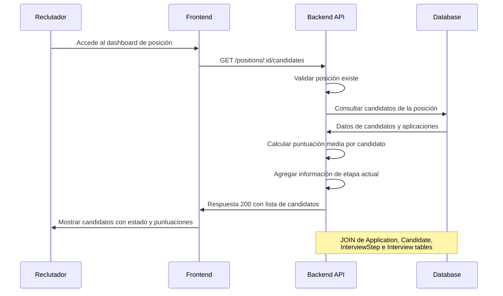
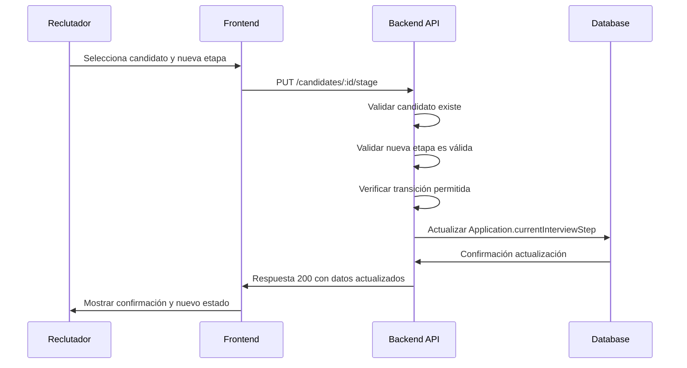

# Historias de Usuario - LTI Sistema de Seguimiento de Talento

## Historia de Usuario #001: Endpoint para Consultar Candidatos por Posición

### 📝 Descripción Funcional Completa

**Como** reclutador del sistema LTI  
**Quiero** obtener una lista de todos los candidatos que están en proceso de selección para una posición específica  
**Para que** pueda hacer seguimiento del progreso de cada candidato y tomar decisiones informadas sobre el proceso de contratación

### Diagrama de Secuencia


### Funcionalidad Detallada
1. El sistema debe permitir consultar candidatos mediante el ID de una posición
2. Para cada candidato, se debe mostrar información básica y su estado actual en el proceso
3. La respuesta debe incluir métricas de rendimiento calculadas automáticamente
4. El endpoint debe manejar casos donde no existen candidatos para la posición

### Flujo de Usuario
1. El reclutador accede al dashboard de una posición específica
2. El sistema realiza una llamada GET al endpoint con el ID de la posición
3. Se obtiene la lista de candidatos con su información consolidada
4. El reclutador puede revisar el estado y puntuación de cada candidato

## 🔧 Especificaciones Técnicas

### Endpoint
- **URL:** `GET /positions/:id/candidates`
- **Parámetros:** `id` (integer) - ID de la posición
- **Respuesta:** Array de objetos candidato con información agregada

### Estructura de Respuesta
```json
{
  "positionId": 123,
  "positionTitle": "Senior Software Engineer",
  "candidates": [
    {
      "candidateId": 456,
      "fullName": "Juan Pérez García",
      "email": "juan.perez@email.com",
      "currentInterviewStep": {
        "stepId": 2,
        "stepName": "Technical Interview",
        "orderIndex": 2
      },
      "averageScore": 8.5,
      "applicationDate": "2024-01-15T10:30:00Z",
      "totalInterviews": 2
    }
  ],
  "totalCandidates": 15
}
```

### Modelos de Datos Afectados
- **Position** - Tabla principal para validar existencia
- **Application** - Para obtener candidatos y su estado actual
- **Candidate** - Para información básica del candidato
- **InterviewStep** - Para detalles del paso actual
- **Interview** - Para calcular puntuación media

### Archivos a Modificar

#### Backend
1. **`/backend/src/routes/positionRoutes.ts`** (nuevo archivo)
   - Definir la ruta GET /positions/:id/candidates

2. **`/backend/src/presentation/controllers/positionController.ts`** (nuevo archivo)
   - Implementar método `getCandidatesByPosition`
   - Validación de parámetros de entrada
   - Manejo de errores y respuestas HTTP

3. **`/backend/src/application/services/positionService.ts`** (nuevo archivo)
   - Lógica de negocio para obtener candidatos
   - Cálculo de puntuación media
   - Agregación de datos de múltiples tablas

4. **`/backend/src/index.ts`**
   - Registrar las nuevas rutas de posiciones

### Consulta SQL Base
```sql
SELECT 
  c.id,
  CONCAT(c.firstName, ' ', c.lastName) as fullName,
  c.email,
  a.currentInterviewStep,
  ist.name as stepName,
  ist.orderIndex,
  a.applicationDate,
  AVG(i.score) as averageScore,
  COUNT(i.id) as totalInterviews
FROM Application a
JOIN Candidate c ON a.candidateId = c.id
JOIN InterviewStep ist ON a.currentInterviewStep = ist.id
LEFT JOIN Interview i ON a.id = i.applicationId
WHERE a.positionId = ?
GROUP BY c.id, a.id, ist.id
ORDER BY a.applicationDate DESC
```

## ✅ Criterios de Finalización

### Validaciones Funcionales
- [ ] El endpoint responde correctamente con código 200 para posiciones existentes
- [ ] Retorna 404 cuando la posición no existe
- [ ] Retorna array vacío cuando no hay candidatos para la posición
- [ ] Calcula correctamente la puntuación media (excluyendo interviews sin score)
- [ ] Maneja correctamente candidatos sin interviews realizadas (averageScore: null)

### Casos de Prueba Básicos
1. **Posición existente con candidatos:** Verificar estructura de respuesta completa
2. **Posición existente sin candidatos:** Verificar array vacío
3. **Posición inexistente:** Verificar error 404
4. **Candidato sin interviews:** Verificar averageScore null
5. **Candidato con interviews sin score:** Verificar cálculo correcto

### Pasos de Verificación
1. Probar endpoint manualmente con Postman/curl
2. Verificar que la puntuación media se calcula correctamente
3. Confirmar que los datos mostrados coinciden con la base de datos
4. Validar formato de fechas ISO 8601
5. Verificar manejo de errores con IDs inválidos

## 📚 Impacto en Documentación y Testing

### Documentación a Actualizar
- **API Documentation:** Agregar especificación del nuevo endpoint
- **CLAUDE.md:** Actualizar con nuevos endpoints disponibles

### Tests Unitarios Necesarios
- **positionController.test.ts:** Tests del controlador
- **positionService.test.ts:** Tests de lógica de negocio
- Mock de Prisma para diferentes escenarios de datos

### Tests de Integración (si existen)
- Test end-to-end del endpoint completo
- Verificación de integridad de datos entre tablas relacionadas
- Performance testing con datasets grandes

### Validaciones de Seguridad
- Verificar que solo se accede a datos autorizados
- Validación de tipos de parámetros de entrada
- Sanitización de respuestas

---

**Estado:** Pendiente de desarrollo  
**Estimación de Desarrollo:** 4-6 horas  
**Complejidad:** Media (requiere agregación de datos de múltiples tablas)  
**Fecha de creación:** 2025-08-13

---

## Historia de Usuario #002: Endpoint para Actualizar Etapa de Candidato

### 📝 Descripción Funcional Completa

**Como** reclutador del sistema LTI  
**Quiero** actualizar la etapa actual del proceso de entrevista de un candidato específico  
**Para que** pueda hacer seguimiento del progreso del candidato y mantener actualizado el estado de su aplicación en el flujo de entrevistas

### Diagrama de Secuencia


### Funcionalidad Detallada
1. El sistema debe validar que el candidato existe en la base de datos
2. Verificar que la nueva etapa pertenece al flujo de entrevistas de la posición
3. Validar que la transición entre etapas es permitida (no puede retroceder a etapas anteriores)
4. Actualizar el campo `currentInterviewStep` en la tabla Application
5. Registrar la fecha de actualización del cambio
6. Retornar la información actualizada del candidato

### Flujo de Usuario
1. El reclutador ve la lista de candidatos para una posición
2. Selecciona un candidato específico
3. Elige la nueva etapa del proceso de entrevista
4. Confirma el cambio de etapa
5. El sistema valida y actualiza la información
6. Se muestra confirmación del cambio exitoso

## 🔧 Especificaciones Técnicas

### Endpoint
- **URL:** `PUT /candidates/:id/stage`
- **Parámetros:** `id` (integer) - ID del candidato
- **Método:** PUT
- **Content-Type:** application/json

### Estructura de Petición
```json
{
  "newInterviewStepId": 3,
  "positionId": 123,
  "notes": "Candidato aprobó la entrevista técnica exitosamente"
}
```

### Estructura de Respuesta
```json
{
  "success": true,
  "message": "Etapa del candidato actualizada exitosamente",
  "data": {
    "candidateId": 456,
    "fullName": "Juan Pérez García",
    "previousStep": {
      "stepId": 2,
      "stepName": "Technical Interview",
      "orderIndex": 2
    },
    "currentStep": {
      "stepId": 3,
      "stepName": "HR Interview",
      "orderIndex": 3
    },
    "positionId": 123,
    "positionTitle": "Senior Software Engineer",
    "updatedAt": "2024-01-15T14:30:00Z"
  }
}
```

### Códigos de Error
- **400:** Datos de entrada inválidos
- **404:** Candidato no encontrado
- **409:** Transición de etapa no permitida
- **422:** Nueva etapa no pertenece al flujo de la posición

### Modelos de Datos Afectados
- **Application** - Actualizar campo `currentInterviewStep`
- **Candidate** - Para validar existencia y obtener información
- **InterviewStep** - Validar etapa nueva y anterior
- **Position** - Verificar que las etapas pertenecen al flujo correcto
- **InterviewFlow** - Validar secuencia de etapas

### Archivos a Modificar

#### Backend
1. **`/backend/src/routes/candidateRoutes.ts`** (archivo existente)
   - Agregar ruta PUT /candidates/:id/stage

2. **`/backend/src/presentation/controllers/candidateController.ts`** (archivo existente)
   - Implementar método `updateCandidateStage`
   - Validación de parámetros de entrada
   - Manejo de errores específicos (400, 404, 409, 422)
   - Respuestas HTTP estructuradas

3. **`/backend/src/application/services/candidateService.ts`** (archivo existente)
   - Implementar método `updateInterviewStage`
   - Lógica de validación de transición de etapas
   - Verificación de permisos de cambio de etapa
   - Actualización de datos en base de datos

4. **`/backend/src/application/validator.ts`** (archivo existente)
   - Añadir validaciones para el endpoint
   - Validar estructura del body request
   - Validar tipos de datos

### Lógica de Validación de Transición
```typescript
// Reglas de negocio para cambio de etapas
const validateStageTransition = (
  currentStepIndex: number, 
  newStepIndex: number
): boolean => {
  // Solo se puede avanzar a la siguiente etapa
  return newStepIndex === currentStepIndex + 1;
}
```

### Consulta SQL Base
```sql
-- Obtener información actual del candidato
SELECT 
  a.id as applicationId,
  a.candidateId,
  a.currentInterviewStep,
  a.positionId,
  c.firstName,
  c.lastName,
  ist_current.orderIndex as currentOrderIndex,
  ist_new.orderIndex as newOrderIndex,
  p.title as positionTitle
FROM Application a
JOIN Candidate c ON a.candidateId = c.id
JOIN Position p ON a.positionId = p.id
JOIN InterviewStep ist_current ON a.currentInterviewStep = ist_current.id
JOIN InterviewStep ist_new ON ist_new.id = ? -- newInterviewStepId
WHERE c.id = ? -- candidateId

-- Actualizar etapa del candidato
UPDATE Application 
SET currentInterviewStep = ?, 
    updatedAt = NOW()
WHERE candidateId = ? AND positionId = ?
```

## ✅ Criterios de Finalización

### Validaciones Funcionales
- [ ] El endpoint responde correctamente con código 200 para actualizaciones válidas
- [ ] Retorna 404 cuando el candidato no existe
- [ ] Retorna 409 cuando se intenta retroceder en etapas
- [ ] Retorna 422 cuando la nueva etapa no pertenece al flujo de la posición
- [ ] Valida que solo se puede avanzar una etapa a la vez
- [ ] Actualiza correctamente el timestamp de modificación

### Casos de Prueba Básicos
1. **Candidato existente con transición válida:** Verificar actualización exitosa
2. **Candidato inexistente:** Verificar error 404
3. **Transición inválida (retroceso):** Verificar error 409
4. **Etapa no pertenece al flujo:** Verificar error 422
5. **Salto de etapas:** Verificar error 409
6. **Datos de entrada inválidos:** Verificar error 400

### Pasos de Verificación
1. Probar endpoint manualmente con Postman/curl
2. Verificar que las validaciones de transición funcionan correctamente
3. Confirmar que los datos se actualizan en la base de datos
4. Validar formato de fechas ISO 8601 en respuestas
5. Verificar manejo correcto de todos los códigos de error
6. Probar con diferentes flujos de entrevista

## 📚 Impacto en Documentación y Testing

### Documentación a Actualizar
- **API Documentation:** Agregar especificación del nuevo endpoint PUT
- **CLAUDE.md:** Actualizar con endpoint de actualización de etapas
- **Business Rules:** Documentar reglas de transición de etapas

### Tests Unitarios Necesarios
- **candidateController.test.ts:** Tests del método updateCandidateStage
- **candidateService.test.ts:** Tests de lógica de validación de transiciones
- **validator.test.ts:** Tests de validaciones de entrada
- Mock de Prisma para diferentes escenarios de datos

### Tests de Integración (si existen)
- Test end-to-end del flujo completo de actualización
- Verificación de integridad referencial entre tablas
- Tests de concurrencia para actualizaciones simultáneas
- Validación de transacciones de base de datos

### Validaciones de Seguridad
- Verificar que solo se pueden actualizar candidatos autorizados
- Validación de tipos de parámetros de entrada
- Sanitización de respuestas y logs de auditoría
- Prevención de inyección SQL en consultas

---

**Estado:** Pendiente de desarrollo  
**Estimación de Desarrollo:** 6-8 horas  
**Complejidad:** Media-Alta (requiere validaciones complejas de flujo de negocio)  
**Fecha de creación:** 2025-08-13