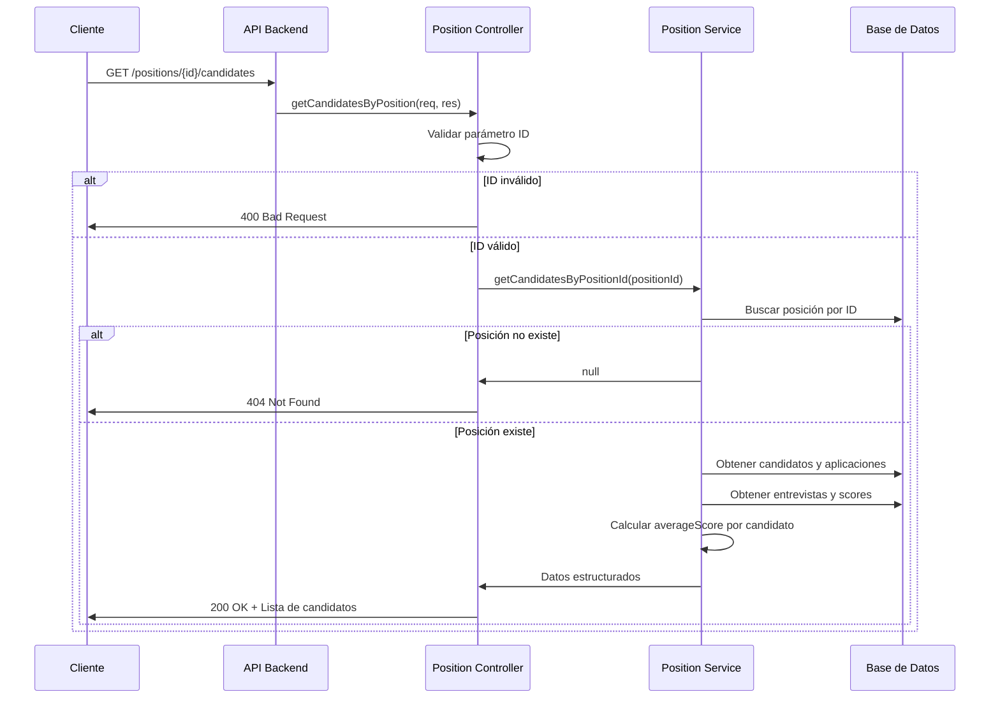

# Historia de Usuario #1: GET /positions/:id/candidates

## 📝 **Descripción Funcional Completa**

### **Historia de Usuario Original**
Como usuario del sistema LTI, quiero obtener una lista de todos los candidatos que han aplicado a una posición específica, para poder revisar y gestionar el proceso de selección de manera eficiente.

### **Diagrama de Secuencia**



### **Funcionalidad Detallada**

1. **Recepción de la petición**: El endpoint recibe una petición GET con el ID de la posición
2. **Validación de parámetros**: Se valida que el ID sea un número entero válido
3. **Verificación de existencia**: Se verifica que la posición existe en la base de datos
4. **Consulta de candidatos**: Se obtienen todos los candidatos que han aplicado a esa posición
5. **Cálculo de scores**: Para cada candidato se calcula el promedio de scores de sus entrevistas
6. **Estructuración de respuesta**: Se formatea la información en una estructura JSON clara
7. **Respuesta al cliente**: Se devuelve la información completa de candidatos

### **Criterios de Aceptación Funcionales**

- ✅ El sistema debe retornar una lista de todos los candidatos para una posición específica
- ✅ Cada candidato debe incluir: ID, nombre completo, email, etapa actual, score promedio, fecha de aplicación
- ✅ El score promedio debe ser `null` si el candidato no ha tenido entrevistas
- ✅ Los candidatos deben estar ordenados por fecha de aplicación (más recientes primero)
- ✅ Si la posición no existe, debe retornar error 404
- ✅ Si no hay candidatos para la posición, debe retornar una lista vacía

## 🔧 **Especificaciones Técnicas**

### **Endpoint**
- **Método**: `GET`
- **URL**: `/positions/:id/candidates`

### **Parámetros de Entrada**
- **Parámetro de ruta**: `id` (número entero, ID de la posición)

### **Respuesta Exitosa (200 OK)**
```json
{
  "success": true,
  "data": {
    "positionId": 1,
    "positionTitle": "Software Engineer",
    "totalCandidates": 2,
    "candidates": [
      {
        "candidateId": 1,
        "fullName": "John Doe",
        "email": "john.doe@gmail.com",
        "currentInterviewStep": {
          "id": 2,
          "name": "Technical Interview",
          "orderIndex": 2
        },
        "averageScore": 4.5,
        "totalInterviews": 2,
        "applicationDate": "2024-08-15T00:00:00.000Z"
      }
    ]
  }
}
```

### **Respuestas de Error**

#### **400 Bad Request**
```json
{
  "success": false,
  "error": {
    "code": "INVALID_POSITION_ID",
    "message": "El ID de la posición debe ser un número entero válido",
    "details": "El parámetro 'id' recibido no es un número entero válido"
  }
}
```

#### **404 Not Found**
```json
{
  "success": false,
  "error": {
    "code": "POSITION_NOT_FOUND",
    "message": "La posición especificada no existe",
    "details": "No se encontró ninguna posición con el ID proporcionado"
  }
}
```

#### **500 Internal Server Error**
```json
{
  "success": false,
  "error": {
    "code": "INTERNAL_SERVER_ERROR",
    "message": "Error interno del servidor",
    "details": "Ha ocurrido un error inesperado en el servidor"
  }
}
```

### **Modelos de Datos Afectados**
- `Position` - Para verificar existencia y obtener título
- `Application` - Para obtener candidatos aplicados y fecha de aplicación
- `Candidate` - Para información personal del candidato
- `Interview` - Para obtener scores de entrevistas
- `InterviewStep` - Para información de la etapa actual

### **Archivos a Modificar**
- `src/routes/positionRoutes.ts` - Nueva ruta para el endpoint
- `src/presentation/controllers/positionController.ts` - Nuevo controlador
- `src/application/services/positionService.ts` - Nueva lógica de negocio
- `src/index.ts` - Registro de las nuevas rutas

## ✅ **Criterios de Aceptación Técnicos**

- ✅ El endpoint debe validar que el parámetro `id` sea un número entero válido
- ✅ Se debe verificar la existencia de la posición antes de buscar candidatos
- ✅ El cálculo del `averageScore` debe ser preciso y manejar casos sin entrevistas (`null`)
- ✅ Las consultas a la base de datos deben ser eficientes (usar includes/joins)
- ✅ El endpoint debe seguir el patrón de respuesta establecido (`success`, `data`/`error`)
- ✅ Se deben implementar tests unitarios y de integración
- ✅ El código debe seguir la arquitectura por capas establecida
- ✅ Se debe implementar logging apropiado para debugging

## 🎯 **Casos de Prueba**

### **Casos Exitosos**
1. Obtener candidatos de una posición con candidatos
2. Obtener candidatos de una posición sin candidatos (lista vacía)
3. Calcular correctamente scores promedio
4. Manejar candidatos sin entrevistas (averageScore null)

### **Casos de Error**
1. ID de posición inválido (no numérico)
2. ID de posición negativo o cero
3. Posición inexistente
4. Error interno del servidor

### **Casos Edge**
1. Candidatos con múltiples entrevistas
2. Candidatos en diferentes etapas del proceso
3. Posiciones con muchos candidatos (performance)
